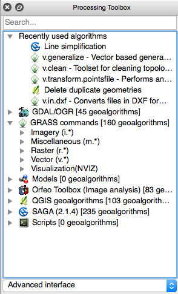
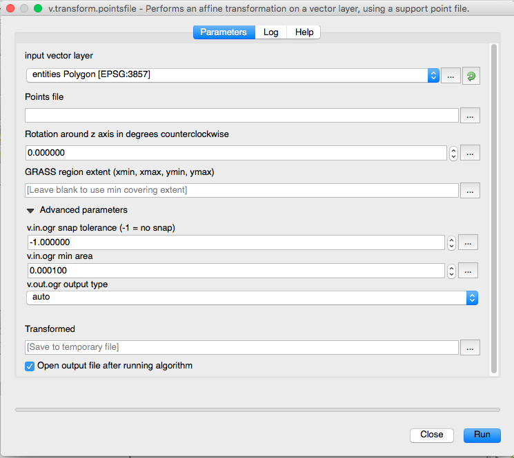

# Vector Layer Processing Steps

The steps below describe how to take a raster map layer from Photoshop, convert that raster image to vector paths in Illustrator, turn those paths into accurately georeferenced vector geometry, and add the geometry to the Seep City Mapbox style.

###Summary:

[1. Photoshop](#in-photoshop)  
Export raster map layer(s) in a format that can be converted to vector paths in Illustrator.

[2. Illustrator](#in-illustrator)  
Convert raster layer(s) to vector paths, then export the vector data in a format that is readable by QGIS.

[3. QGIS](#in-qgis)  
Transform/georeference the geometry so that its size and position are accurate the in the chosen coordinate system, and save the data in a format readable by Mapbox.

[4. Mapbox](#in-mapbox-studio)  
Import the data and add it as a layer to the Seep City map style in Mapbox Studio.
  

###1. In Photoshop:

_Note: These steps were developed using Photoshop CS4, and may not apply directly to other versions of Photoshop._

To batch prepare a set of raster layers in a Photoshop file for import into Illustrator, follow these steps:

1. Duplicate the full .psd file and open the duplicate
2. Go to Image > Mode > Greyscale
3. Make visible only the layers you want to vectorize
4. For all visible layers with Effects, drag the effects to the layer trash
5. Ungroup layer groups (delete the group folder only, not the folder content)
    * Not sure if this was the reason for earlier trouble but do it to be safe, because it worked!

	_Note: Steps 6 and 7 are unnecessary. The current pointsfile, `vector_transform.points`, used in transformation seems to produce acceptable results, although there may be a way to create a photoshop layer that can be used for better groundtruthing of reference points._

6. Use Single-row Marquee Tool to select top row of pixels on the canvas
7. Add a one-pixel stripe across the top of each layer, as follows:
    * Click on the layer to go there
    * Shift-F5 (or Edit > Fill...) Black; Opacity 100%
    * Go to next visible layer and repeat
8. Go through each layer again making all pixels solid black as follows:
    * Click on the layer to go there
    * Click on the icon of the layer
    * Change opacity to 100% (if not already)
    * Command-click on the icon (selects all non-empty pixels in the layer)
    * Shift-F5 (or Edit > Fill...) Black; Opacity 100%
10. File > Scripts > Export Layers to Files...
    * Select PSD as the file type
    * Visible layers only (checked)
    * Transparency (checked)
    * _Trim layers (checked)_
    
    This exports each layer to its own file.

Final layer-by-layer prep in Photoshop CS4 for Illustrator CS4:

_Note: These steps can be automated using Actions._

1. Open each layer by itself as an image in Photoshop
2. Image > Mode > Bitmap… 680 pixels per inch and 50% threshold
3. Save as PNG

###2. In Illustrator:

_The way that Joel is currently doing the conversion from raster to vector results in duplicate vector paths that need to be removed for successful export to DXF. Can we figure out how to convert to vector paths without duplicate paths?_
	
To convert map layers from bitmap to .ai vector files:

1. Open the map layer PNG in Illustrator
2. Go to Object > Live Trace > Tracing Options... click OK to bypass large image alert
3. In dialog, choose Preset called 'Tracing Preset 1' which is
        Mode: Black & White
        Path Fitting: 0.9 px
        Minimum area: 10 px
        Corner angle: 180
        Vector: Tracing result
        Fills checked, all others unchecked
4. Click 'Trace'
5. Click 'Expand' in the toolbar
6. Object > Path > Add Anchor Points
7. Object > Path > Add Anchor Points (if it allows)
8. Object > Path > Add Anchor Points (if it allows)
9. Object > Path > Simplify with straight lines clicked, 0 angle
10. Save As... .ai CS4 file

In order to import the files into QGIS, they need to be saved as DXF files (AutoCAD interchange files).
	
1. Open the layer .ai file
2. Go to Object > Artboards > Fit to Artwork Bounds
	* _Actions can can be used to automate this step for multiple files_
3. Go to Select > All, or click once anywhere on the artwork to select all paths (all paths should be grouped initially)
4. Go to Object > Ungroup to remove the top-level path grouping
5. Click once on the artwork to select the top layer of paths, which includes duplicate shapes and a path extracted from the extent of the original map layer
	* Press Delete to remove these unnecessary paths
6. Go to File > Export and select 'AutoCAD Interchange File (dxf)' as the export format
	* The default export settings should be fine
	* _Actions can be used to batch export multiple files_

###3. In QGIS:

1. Open  `vector_transform.qgs`  from Data > Georeferencing
	* _This QGIS project can have a few settings ready to go for georeferencing, otherwise just creating a new project is fine_
2. Make sure the GRASS geoprocessing plugin is installed
	* Go to Plugins > Manage and Install Plugins to view installed plugins and add new ones
3. To show the processing toolbox, go to Processing > Toolbox
	* With Advanced Interface selected at the bottom of the toolbox, the GRASS geoprocessing tools should be visible
		
		
		
4. Go to Layer > Add Layer > Add Vector Layer and choose the DXF file(s)
5. When prompted to select CRS for the layer source, choose EPSG:3857 (WGS 84 / Pseudo Mercator)
6. When prompted to select which geometry types to import, choose the Polygon layer (do not select LineString layer)
7. When prompted to select a CRS for the imported layer, choose EPSG:3857 (WGS 84 / Pseudo Mercator)
8. If georeferencing one layer:
	* In the Processing Toolbox, under GRASS commands > Vector, select 'v.transform.pointsfile' to bring up the tranformation dialog box
		
		

	* Choose the DXF layer you just imported as the input layer
	* For the points file, browse to Data > Georeferencing > `vector_transform.points`
	* Under Transformed, click the browse button and choose 'Save to file'
	* Browse to the appropriate folder (transformed shapefiles are currently in Data > Shapefiles > Transformed Raster Layers) and give the layer an appropriate name
	* Keep ‘Open output file after running algorithm’ checked
	* Click Run to execute the algorithm. If all goes well, the transformed shapefile should show up in the layers panel.
	* Right click the layer and select ‘Zoom to Layer’
	* The layer should now be positioned correctly relative to the basemap
	* _Remove any geometry that was included only for georeferencing purposes_
_9. If georeferencing a batch of layers:_
	* _QGIS has a batch processing feature, which will be outlined here if necessary_
	* _Way to auto name layers?_
	* _Might be able to batch process shape files without actually adding them as layers_
	* _The whole QGIS process could also be automated with a python script down the road if it ever seems worth it_

###4. In Mapbox Studio:

1. Log into [Mapbox Studio](https://www.mapbox.com/studio/) using the _jpomerantz_ account
2. In the left menu bar, select Tilesets, then click 'New tileset'
3. Choose the georeferenced shapefile you just created as the file to upload
4. When the upload process finishes, the tileset will be ready to add to the Seep City map style as a new layer

	
